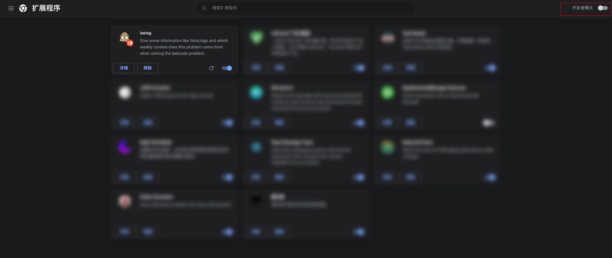
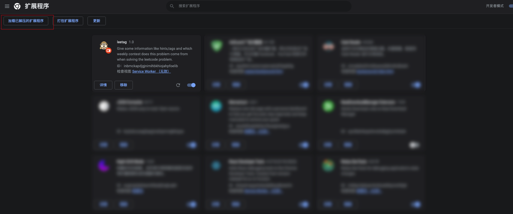
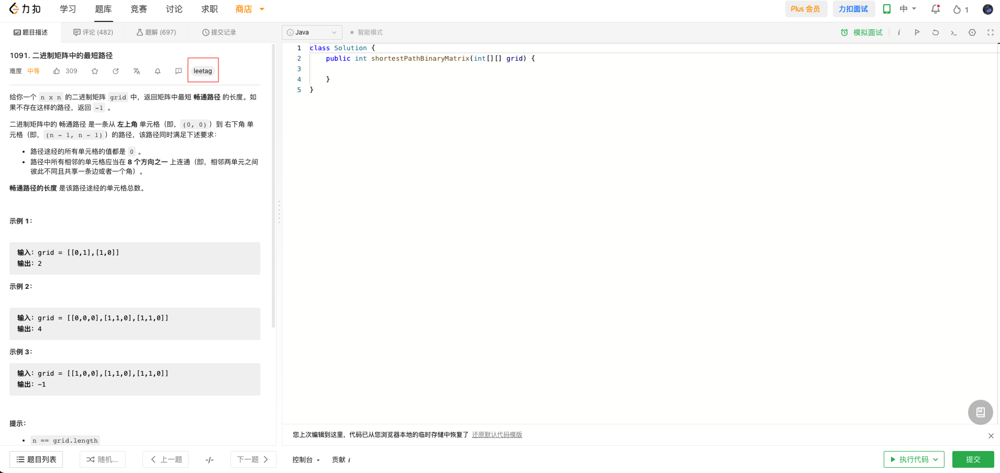

<p align="center"></p>

# leetag

​	Sometimes, I have no idea how to resolve a question from Leetcode.Same to you, I really don't want to click the "Solution" directly, because it lacks fun to resolve the question at all, so I usually open the comment component to find some inspiring discussion. But I found that if someone can **give me some tags or short hints** about the question like what method to use, such as arrays, greedy algorithm, dynamic programming, etc., I can quickly start coding. The tags and hints on Leetcode are **hidden in the lower left corner**. I think this kind of way to display  is a liitle bit troublesome. So I write this chrome extension.

### Introduction

​	This project is a chrome extension working on leetcode platform, which can remind you the tags and hints of the problem you're struggling with in a soft way. Meanwhile, it can show you which weekly contest this question has occurred in with a tag attached question title. That's why one named "leetag".

### Install

This extension uses Chrome Extension API `menifest V3`. So please make sure your chrome version is **88+**.

- Clone this repository , run  `git clone xxxx`

- Open the chrome extensions page. You can visit `chrome://extensions/` 

- Open the **Developer Mode**

  

- Click here and choose the file you've cloned from this repository.

  

- Visit the `https://leetcode.cn/problemset/all/`,and select any problem you want to resolve.

- You will see the `leetag` button locating here.

  

- If the above works, please star my repostry.

### Usage

- When you visit **leecode.cn** website and open a question, `background.js` fetches the question data and weekly contest data, automatically.
- If you wonder which weekly contest this question has occurred in, you're able to click the `leetag` button.
- then,
  - If you want to know the tags about this question, click the `tag` button.
  - If you want to get some hints for this question, click the `hints` button.

<video src="doc/leetag.mov"></video>

### Warning and TBD

- This extension hasn't **supported leetcode beta**, so it can't work on the new version platform.

  - Interfaces are reserved in `content.js`. `background.js` will automatically fetch **"isBeta"** in the background, a data that identifies whether the user is using the new version of the interface. In content.js, only modify `toolBarClassName` and `titleClassName` to the corresponding className of the new version

- If you have refreshed the extension, please reload the leetcode website. 

  - This limitation is caused by local installation.

  - If you forget to refresh the website **after refreshing the extension**, you will receive the following error reminder in the console:

    ```bash
    1. please refresh the website and try again.
    2. {title} undefined
    ```

- Some fetching bug can solve after refresh.

### Related Projects

Thanks to **leetcode.cn** for providing a platform with a friendly user experience!

Thanks to the data support from [zerotrac](https://github.com/zerotrac)/[leetcode_problem_rating](https://github.com/zerotrac/leetcode_problem_rating)!

